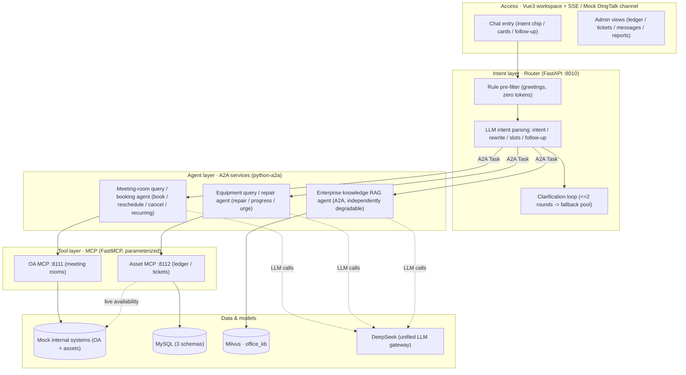

# Office Agent — Multi-Agent Workplace Assistant


A multi-agent internal-office assistant built on the **A2A protocol + MCP**: employees complete meeting-room booking / rescheduling / cancellation / recurring meetings, equipment lookup, repair tickets with progress & urging, and enterprise knowledge Q&A in one sentence. Agents are deployed independently, tools are fully parameterized, and responses stream over SSE.

## Features

- **A2A heterogeneous agents** — meeting-room, equipment and knowledge services are independent deployments; booking re-checks availability via an A2A chain call.
- **MCP parameterized tools** — fixed parameters only (no raw SQL passthrough), idempotency keys + audit logs, `X-MCP-Key` service auth.
- **Three-tier data strategy** — real-time meeting rooms (never persisted), daily-synced equipment ledger, real-time availability, read-only aggregated reports.
- **Intent routing with clarification loop** — one LLM call returns intents / rewritten query / slots / follow-up; at most 2 clarification rounds, then a fallback pool.
- **Fault tolerance** — retries (3x, 1s/2s/4s backoff) → graceful degradation → system fallback; the RAG agent can be shut down without breaking the main flow.
- **Proactive service** — in-app reminders (15 min before meetings / SLA-breached tickets, verified against live data) and admin-only operations reports.
- **Quality system** — 73-case intent evaluation (98.6% / 100% / 100%) + one-command full regression over 17 scripts + 10 SQL-injection payload regressions.

## Architecture



## Tech Stack

| Layer | Stack |
|---|---|
| Backend | Python 3.11 · FastAPI · SQLAlchemy (async) · MySQL · APScheduler |
| Agents | python-a2a (A2A) · MCP (FastMCP streamable-http) · LangChain (OpenAI-compatible) · DeepSeek |
| Retrieval | Milvus + BGE-M3 (dense + sparse hybrid, WeightedRanker 1.0/0.7) |
| Frontend | Vue3 · Element Plus · Vite · SSE |
| Tooling | Docker Compose · PowerShell scripts · GitHub Actions |

## Quick Start

```powershell
# 1. Dependencies & config
python -m pip install -r requirements.txt
Copy-Item .env.example .env        # fill in DEEPSEEK_API_KEY and BGE_M3_MODEL_PATH

# 2. Infrastructure (Docker Desktop required)
docker compose up -d mysql etcd minio milvus

# 3. First-time init: data + knowledge base
python scripts\init_db.py
python scripts\seed_data.py
python scripts\sync_assets.py
python scripts\init_office_milvus.py
python scripts\build_office_kb.py

# 4. Start services (see scripts\start_all.ps1 for the full list)

# 5. Health check
curl http://localhost:8010/health
```

## Ports

| Service | Port |
|---|---|
| FastAPI gateway (Router / SSE / JWT / channels) | 8010 |
| Meeting-room query / booking agents (A2A) | 5011 / 5012 |
| Equipment query / repair agents (A2A) | 5013 / 5014 |
| Knowledge RAG agent (A2A) | 5015 |
| OA MCP / Asset MCP (FastMCP) | 8111 / 8112 |
| Mock internal systems | 8210 |
| MySQL / Milvus | 3309 / 19532 |
| Frontend dev (Vue3 + Vite) | 3010 |

## Full Regression

```powershell
python scripts\run_all_checks.py     # 17 verification scripts, logs under logs/checks/
```

Covers: functionality / concurrency / authorization / injection safety / degradation / RAG / reminders / reports / recurring meetings / channels / intent evaluation.

## Repository Layout

```
backend/        FastAPI gateway (router / SSE / conversation core / reminders / reports / channels)
agents/         A2A services (meeting rooms x2, equipment x2, knowledge RAG)
mcp_servers/    MCP tool servers (parameterized + audited)
services/       Mock internal systems (OA + assets)
scripts/        Init / seed / sync / evaluation / security / acceptance scripts
data/           Knowledge-base docs (kb/) and intent eval sets (eval/)
frontend/       Vue3 workspace (chat / ledger / tickets / messages / reports)
docs/           Implementation plan, acceptance records, evaluation & security reports, screenshots
```
