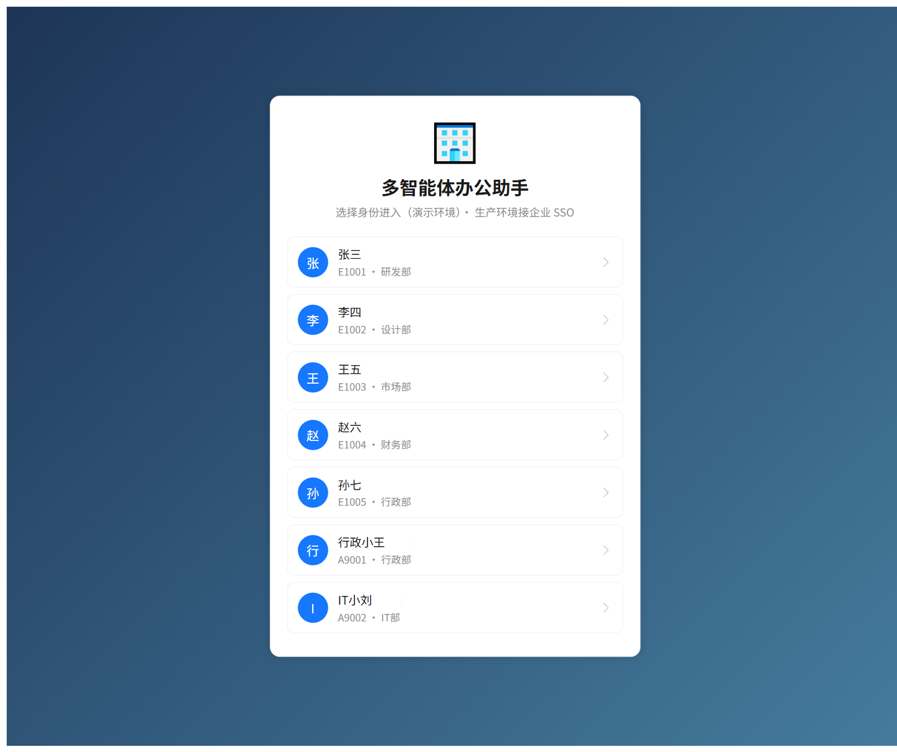
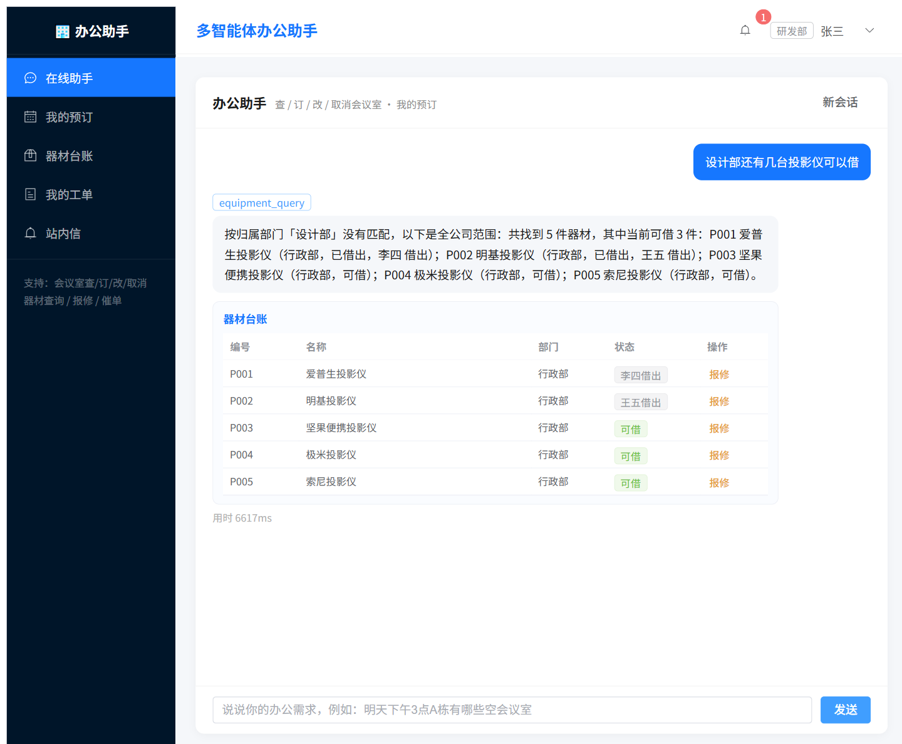
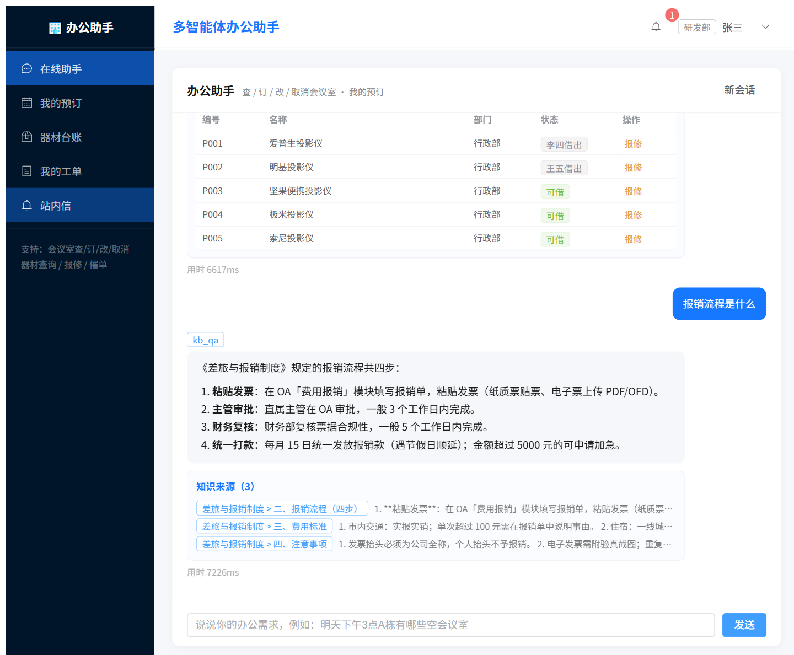
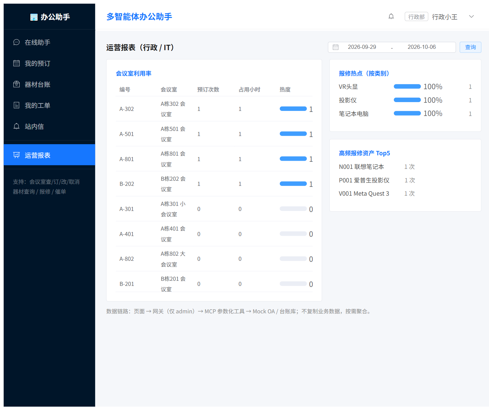
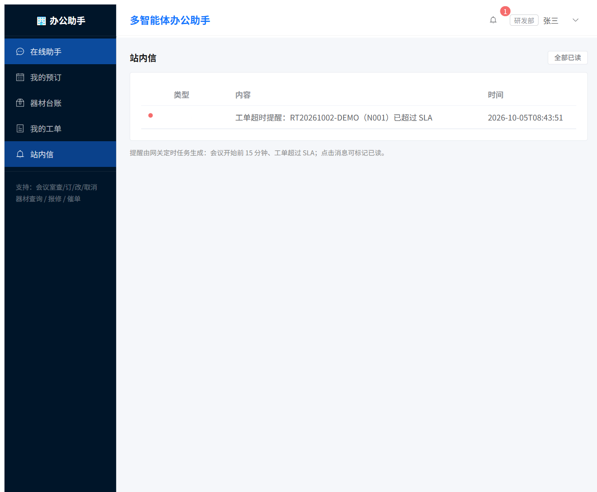
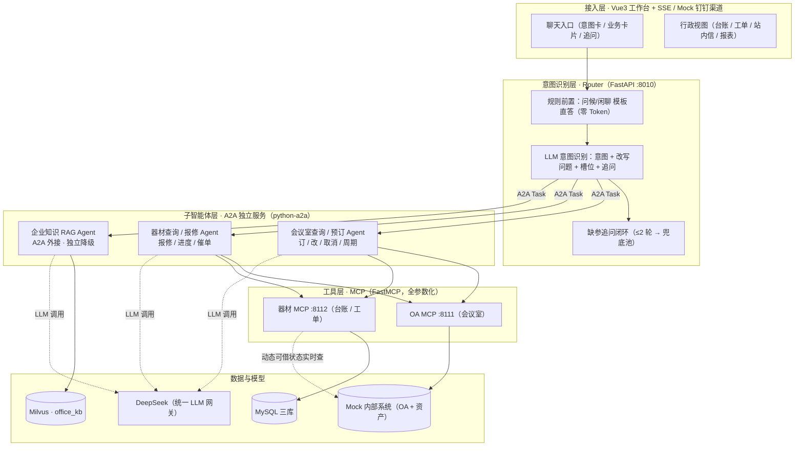

# 多智能体办公助手（office-agent）


基于 **A2A 协议 + MCP** 的多智能体企业办公助手：员工一句话完成会议室查询 / 预订 / 改期 / 取消 / 周期会议、器材查询、报修 / 进度 / 催单、企业知识问答；独立 Agent 部署、MCP 参数化工具、SSE 流式返回。

## 界面预览

| 一键身份登录 | 器材查询（卡片 + 实时可借状态） |
|---|---|
|  |  |

| 知识问答（RAG，带来源） | 运营报表（行政角色） |
|---|---|
|  |  |



## 架构总览



**主链路：** 规则前置 → LLM 意图/槽位/追问 → 条件不全先追问 → A2A 分发到业务 Agent → MCP 调用数据源 → 结果整理为卡片 + 口语回答 → SSE 流式返回。

## 核心特性

- **A2A 异构 Agent**：会议室 / 器材 / 知识库三类服务独立部署、独立升级；预订前经 A2A 串行复查可用性。
- **MCP 参数化工具**：只暴露固定参数（无 SQL 直通），写操作幂等键 + 审计；`X-MCP-Key` 服务间鉴权。
- **三层数据策略**：会议室强实时（不落库）· 器材静态每日同步 / 动态实时查询 · 报表只读聚合。
- **意图识别 + 追问闭环**：一次输出意图/改写/槽位/追问，最多追问 2 轮，超限进兜底池。
- **容错与降级**：重试 3 次（1s/2s/4s 指数退避）→ 降级话术 → 系统兜底；关停 RAG 只降级不 500。
- **主动服务**：站内提醒（会前 15 分钟 / 工单超时，实时复核防过期）；运营报表（仅 admin）。
- **质量体系**：73 条意图评测集（98.6% / 100% / 100%）+ 17 个验收脚本一键全量回归 + 10 类注入安全回归。

## 技术栈

| 层 | 技术 |
|---|---|
| 后端 | Python 3.11 · FastAPI · SQLAlchemy(async) · MySQL · APScheduler |
| 智能体 | python-a2a（A2A）· MCP（FastMCP streamable-http）· LangChain（OpenAI 兼容）· DeepSeek |
| 检索 | Milvus + BGE-M3（稠密+稀疏混合，WeightedRanker 1.0/0.7）· FlagEmbedding |
| 前端 | Vue3 · Element Plus · Vite · SSE |
| 工程 | Docker Compose · PowerShell 一键脚本 · GitHub Actions |

## 快速开始

### 一键启动（推荐）

```powershell
powershell -ExecutionPolicy Bypass -File scripts\start_all.ps1   # 起全部服务（含 MySQL/Milvus）
powershell -ExecutionPolicy Bypass -File scripts\stop_all.ps1    # 停止
```

### 手动方式

```powershell
# 1. 依赖（Python 3.11）与配置
python -m pip install -r requirements.txt
Copy-Item .env.example .env        # 填入 DEEPSEEK_API_KEY 与 BGE_M3_MODEL_PATH

# 2. 基础设施（Docker Desktop 需运行）
docker compose up -d mysql etcd minio milvus

# 3. 首次初始化：数据 + 知识库
python scripts\init_db.py
python scripts\seed_data.py
python scripts\sync_assets.py
python scripts\init_office_milvus.py
python scripts\build_office_kb.py

# 4. 按 start_all.ps1 的清单逐个起服务（网关 / 5 个 A2A Agent / 2 个 MCP / Mock 内部系统 / 前端）

# 5. 健康检查
curl http://localhost:8010/health
```

## 服务与端口

| 服务 | 端口 | 说明 |
|---|---|---|
| FastAPI 网关 | 8010 | Router / SSE / JWT / 渠道适配 |
| 会议室查询 Agent | 5011 | A2A |
| 会议室预订 Agent | 5012 | A2A（订/改/取消/周期） |
| 器材查询 Agent | 5013 | A2A（静态+动态融合） |
| 器材报修 Agent | 5014 | A2A（报修/进度/催单） |
| 知识库 RAG Agent | 5015 | A2A（office_kb 检索 + 带来源回答） |
| OA MCP Server | 8111 | FastMCP streamable-http（8 个工具） |
| 器材 MCP Server | 8112 | FastMCP streamable-http（7 个工具） |
| Mock 内部系统 | 8210 | 模拟 OA + 资产系统（台账源 / 动态状态） |
| MySQL | 3309 | office_oa / office_asset / office_app |
| Milvus | 19532 | office_kb 向量库（含 etcd/minio 容器） |
| 前端 dev | 3010 | Vue3 + Vite |

## 全量回归（AI 项目的"测试门禁"）

```powershell
python scripts\run_all_checks.py     # 17 个验收脚本一键回归（约 7 分钟），日志落盘 logs/checks/
```

> 覆盖：功能 / 并发 / 越权 / 注入安全 / 降级 / RAG / 提醒 / 报表 / 周期 / 渠道 / 意图评测。

## 渠道入口（Mock 钉钉）

```powershell
# 模拟钉钉机器人回调（验签可选：md5("staff_id:text:key")[:8]）
curl -X POST http://localhost:8010/api/v1/channels/mock-dingtalk/webhook `
  -H "Content-Type: application/json" `
  -d '{"staff_id":"E1001","text":"明天下午3点A栋有哪些空会议室"}'
```

## 项目结构

```
backend/        FastAPI 网关（Router / SSE / 会话内核 / 提醒任务 / 报表 / 渠道适配）
agents/         A2A 独立业务 Agent（会议室 ×2 / 器材 ×2 / 知识库 RAG）
mcp_servers/    MCP 工具服务（OA / 器材，参数化 + 审计）
services/       Mock 内部系统（OA + 资产：会议室实时数据 / 台账源 / 动态状态）
scripts/        初始化 / 种子 / 同步 / 评测 / 安全 / 验收（含 run_all_checks.py）
data/           知识库文档（kb/）与意图评测集（eval/）
frontend/       Vue3 工作台（对话 / 台账 / 工单 / 站内信 / 报表）
docs/           实施计划、验收记录、评测报告、安全记录、界面截图
```

## 文档索引

- V1 实施计划：`docs/多智能体办公助手V1实施计划.md`
- 验收记录：`docs/p0_验收记录.md` ~ `docs/p10_验收记录.md`
- 意图评测报告：`docs/office_intent_eval_report.md`
- 安全加固记录：`docs/p7_安全加固记录.md`

## 说明

- 演示环境大模型为 DeepSeek（统一 LLM 网关，多 provider 链可配置）；
- 只上报实测数字，评测/回归脚本均可复现；
- 密钥不进 Git：`.env` 已加入 `.gitignore`。
